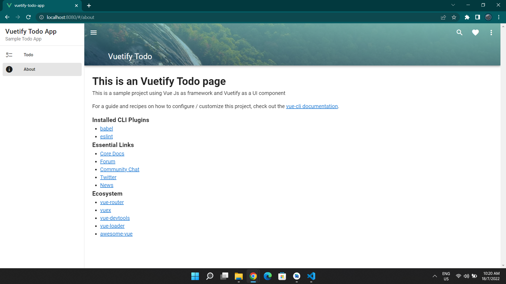
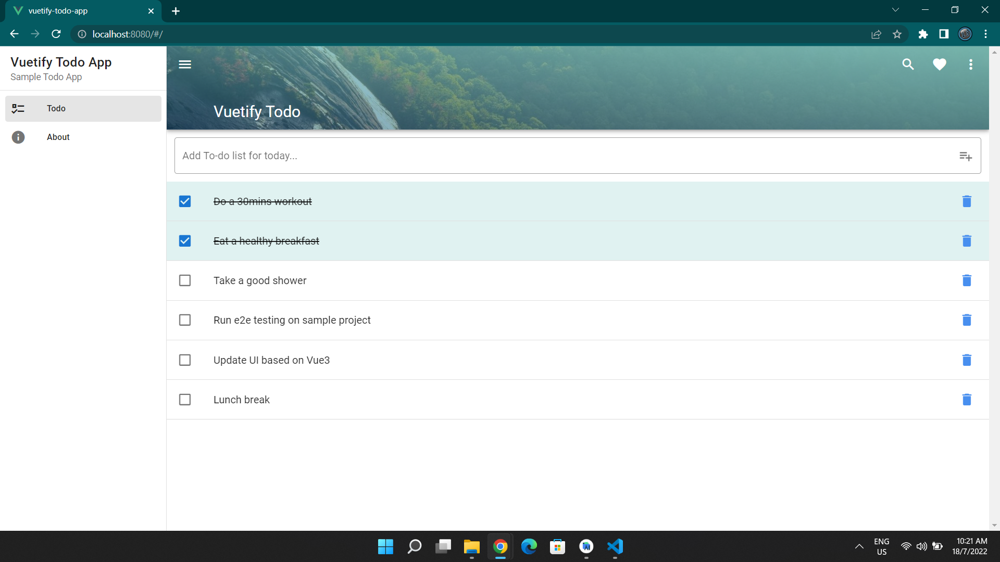
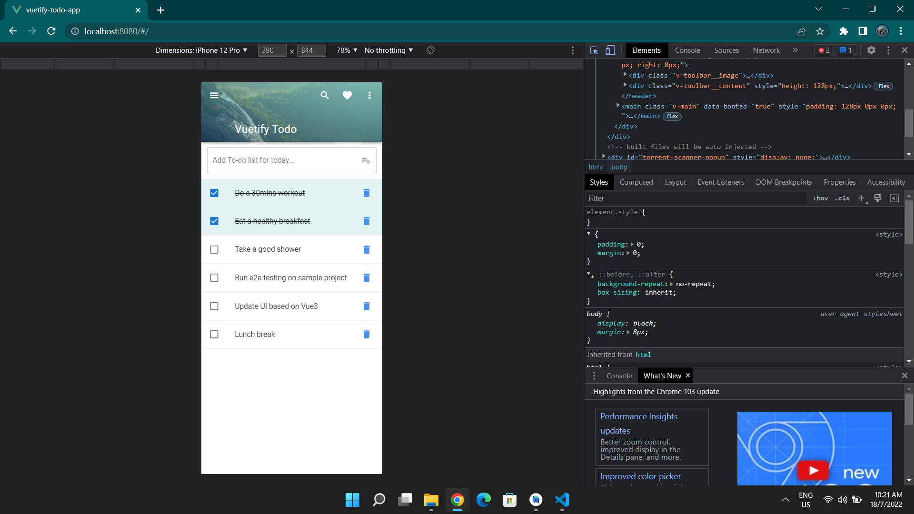
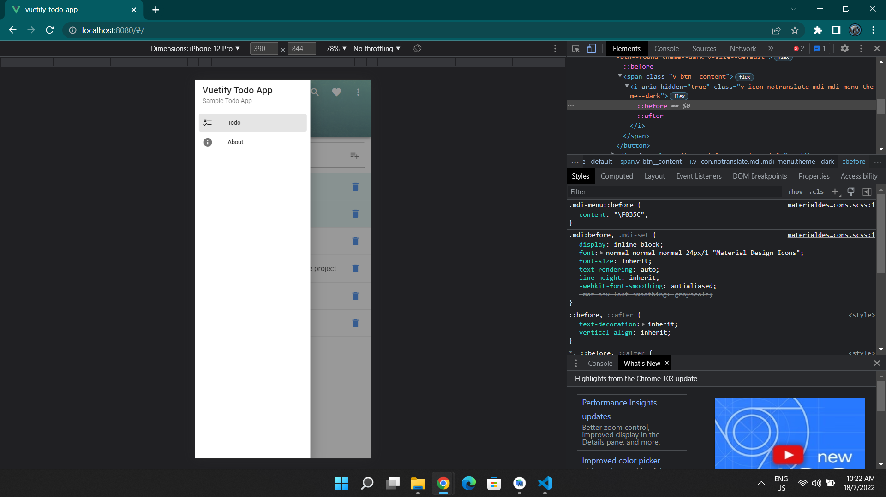

# vuetify-todo-app

## Introduction
This repo is for example on implementation of Vue CLI as framework. This project also using Vuetify as material design on interface. This project support on cross platform based which is mobile and website.

## Pre-requisites
1. Git client: https://git-scm.com/download/win
2. Vue CLI: https://cli.vuejs.org/
3. NodeJs: https://nodejs.org/en/
4. IDE such as VS code
5. Vuetify for material design interface: https://vuetifyjs.com/en/

## Project setup
```
npm install
```

### Compiles and hot-reloads for development
```
npm run serve
```

### Compiles and minifies for production
```
npm run build
```

### Features availability
1. Add todo notes
2. Checklist box
3. Delete button
4. Clear text on add todo field
5. About page

### Work in progress Features
1. No task / task complete info
2. snackbars
3. Pop up dialog for edit/delete button
4. Real-time date and time for todo notes

### Demo





### Customize configuration
See [Configuration Reference](https://cli.vuejs.org/config/).
